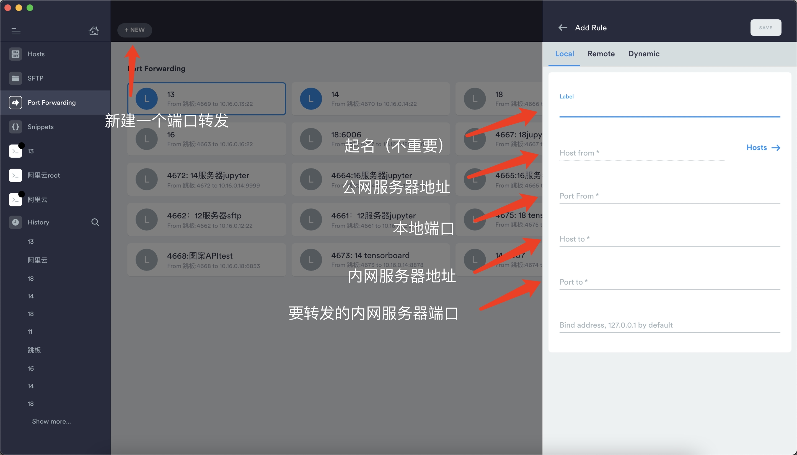

# SSH Port Forwarding 端口转发

- 为什么要使用Port Forwarding？

  公司一般为了保护服务器的安全，避免被攻击，会把服务器放在内部局域网中，只留一个跳板机的IP地址暴露在公网。此时，用户就无法通过公网IP地址来直接访问服务器，而需要先登录跳板机，再从跳板机通过内网IP地址连接服务器。那这样__先登录跳板机再登录服务器__的操作就比较麻烦，并且一次连接相当于连了两层服务器，体验极差，所以一般使用SSH port Forwarding来简化操作。

- port Forwarding的原理

  在基于一个安全连接（比如ssh）的前提下，把向某个机器某某个端口发送的数据转发到另一个机器（也可能是同一个机器）的某个端口。

- 如何使用Port Forwarding？

  - Local Port Forwarding：主要解决通过跳板机连接内网服务器的问题【**主要使用**】

    `ssh -L local_port:destination_server_ip:remote_port ssh_server_hostname`

    例如

    `ssh -L 1248:10.20.30.40:22 burning846@github.com`

    在上面的例子中，所有发送给本地`1248`端口的请求都会被`github.com`服务器转发到内网IP地址为`10.20.30.40`的服务器的`22`（ssh）端口上。

    这样，在本地想使用ssh或sftp访问内网服务器时，只需要使用下面的指令

    `ssh -p 1248 username@127.0.0.1` 或者 `ssh -p 1248 username@localhost`

    就可以连接到内网服务器了。

    **PS：这个ssh命令需要一直运行，也就是保持ssh连接，可以放在后台挂起**

  - Remote Port Forwarding：主要解决内网服务器向外提供服务的问题【其实没用过】

    `ssh -R remote_port:localhost:local_port ssh_server_hostname`

    例如

    `ssh -R 10022:localhost:22 burning846@github.com`

    在上面的例子中，所有`github.com`服务器对自身10022的访问都会被转发到当前机器的22端口，如果外面的人想访问内网服务器，只需要先登录`github.com`服务器，在ssh到自身的10022端口即可，此时`github.com`服务器就变成了跳板机。

## terminus建立端口转发示例

> 参考资料
>
> https://abcdabcd987.com/ssh/
>
> https://phoenixnap.com/kb/ssh-port-forwarding